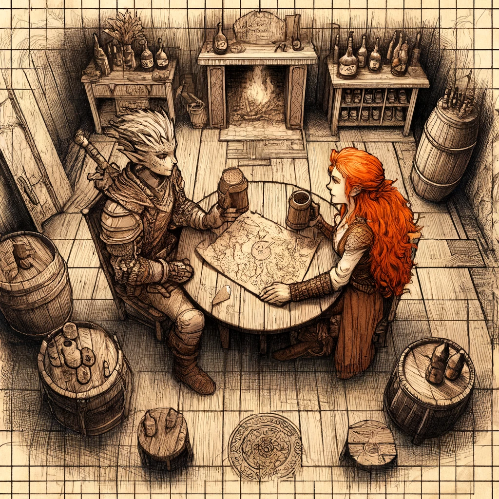
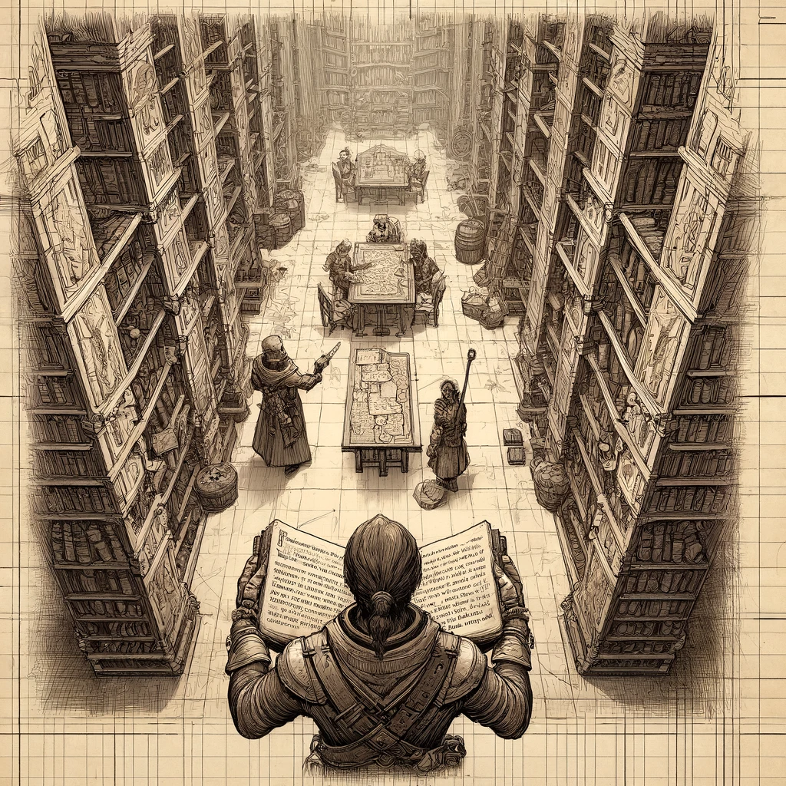
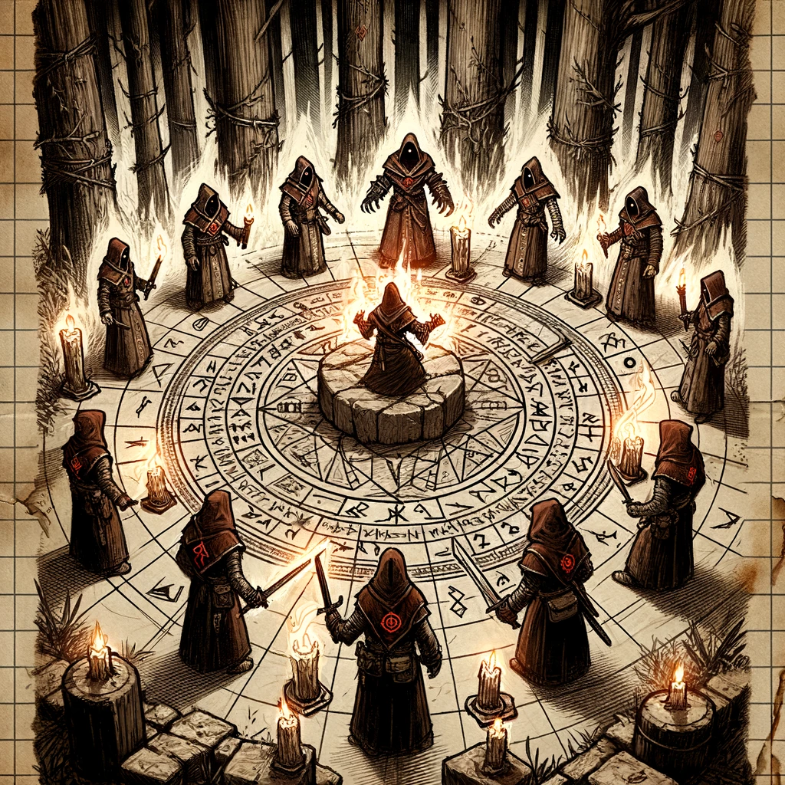
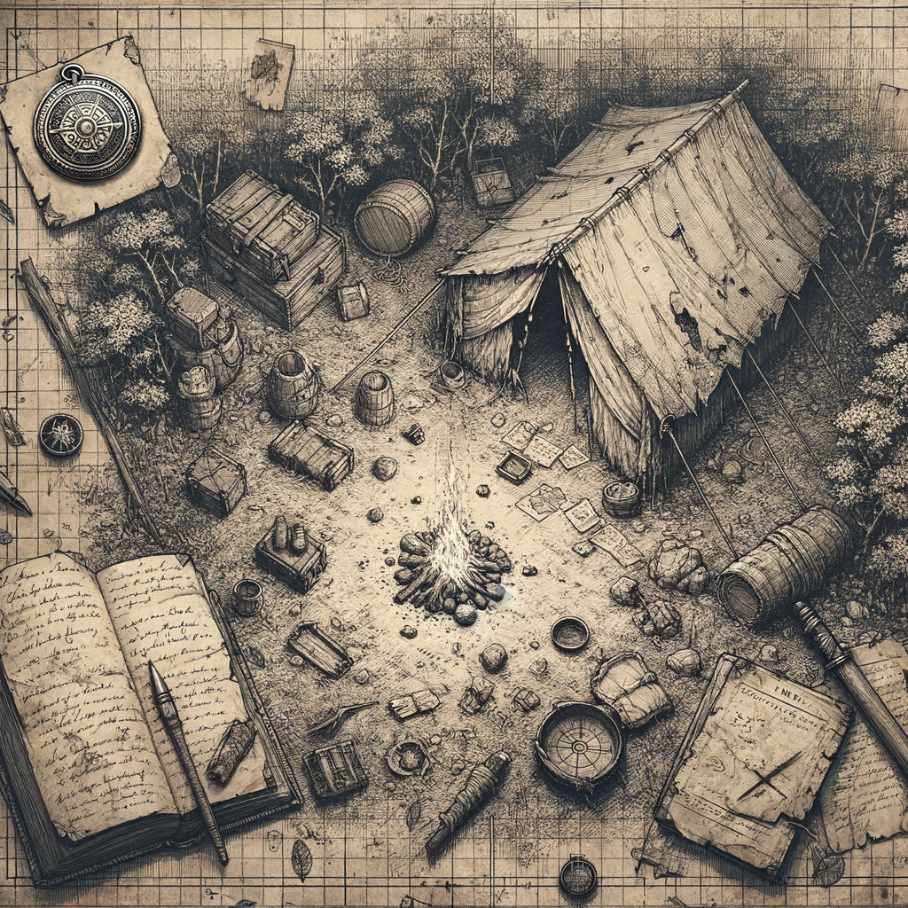
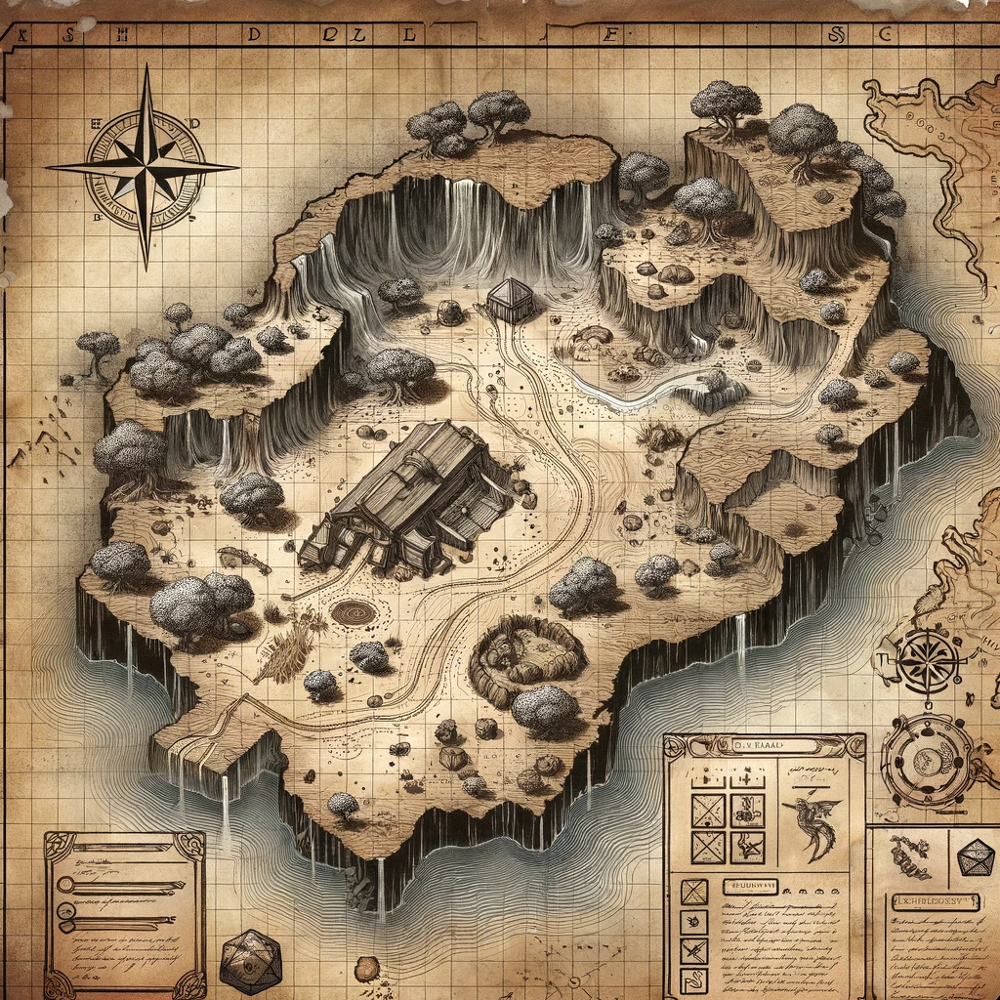

# Session 1: The Beginning of the Quest

## Overview
Cindor, a Fire Genasi Eldritch Knight, began his quest to uncover the secrets of the Lost Forge of the Spellsmith. Joined by Eleria Whispersong, a knowledgeable historian, they embarked on a journey filled with peril and discovery, uncovering vital clues about the Hand of Ash and the Elemental Blade of Prometheus.

## Journey Log
Today was a day of significant encounters and discoveries. As we ventured through Emberhold and the Whispering Woods, we encountered key individuals and uncovered critical information about the Hand of Ash and their sinister plans.

### Meeting Eleria Whispersong
At the Embered Hearth Tavern, I met Eleria Whispersong, a striking woman with fiery red hair and emerald-green eyes. She approached me with vital information about the Lost Forge of the Spellsmith and the Elemental Blade of Prometheus. We decided to join forces and embark on this perilous journey together.

### Researching at the Grand Library of Ashenwall
Our next stop was the Grand Library of Ashenwall, a vast repository of knowledge. With the guidance of Archivist Maren and Rothgar the Rogue Scholar, I delved into the history of the Elemental Blade of Prometheus, uncovering its connection to my ancestors. The library's ancient tomes and scrolls provided invaluable insights into the blade's origins and its significance.

### Securing Assistance from Captain Zara Stormshield
To better prepare for the challenges ahead, Eleria and I sought the help of Captain Zara Stormshield at the City Guard Headquarters. Captain Stormshield provided us with detailed maps, essential supplies, and crucial information about the Hand of Ash's movements. Her support bolstered our confidence as we ventured into the unknown.

### Journey through Whispering Woods
With our preparations complete, we set out towards the Whispering Woods. The forest was dense and foreboding, known for its treacherous terrain and eerie atmosphere. Navigating through key landmarks such as the Old Watchtower, we discovered a hidden path leading deeper into the forest. Along the way, we encountered an abandoned campsite, finding a pendant bearing the symbol of the Hand of Ash and a journal with notes about a ritual and a gathering at the stone circle.

### Investigating the Stone Circle
Following the hidden path, we reached an ancient stone circle. The site was marked by glowing runes and remnants of a ritual setup, including candles and ritual knives. The air felt charged with lingering magic, and tracks leading away from the circle indicated that the cultists had recently moved on. This discovery added another layer of mystery and danger to our journey.

### Battle at the Hidden Cove
Our journey through the Whispering Woods led us to a hidden cove guarded by the Hand of Ash cultists. A fierce battle ensued, during which we defeated the cultists and secured important artifacts. Among the items we found were a runed dagger, which Eleria identified as a magical focus for binding elemental spirits, and ritual notes detailing the cult's plans. These artifacts are not only valuable in themselves but also provide critical information about the cult's operations and their connection to the Lost Forge of the Spellsmith.

## Notable Events
- **Battle at the Hidden Cove:** A fierce battle with the Hand of Ash cultists led to the discovery of important artifacts and clues.

### Learnings and Reflections
Reflecting on the day's events, I realize the importance of ancient lore and teamwork. The challenges we faced have taught me the potential of the Elemental Blade of Prometheus and the necessity of vigilance against the cult's plans. The artifacts we recovered today are crucial pieces in the puzzle of the Lost Forge. Each encounter, each clue brings us one step closer to our goal.

### Next Steps
With the new information and resources we've gathered, our immediate objectives are:
1. Investigate the first ritual site marked on the map to uncover more about the cult’s plans.
2. Track the cultists’ movements to prevent any future threats.
3. Report our findings back to Emberhold and seek further support from Captain Zara Stormshield.

### Experience Gained
Total experience points earned: 775

## Images
Include the following images to visually represent the day's adventures:
- 
- 
- 
- 
- 
