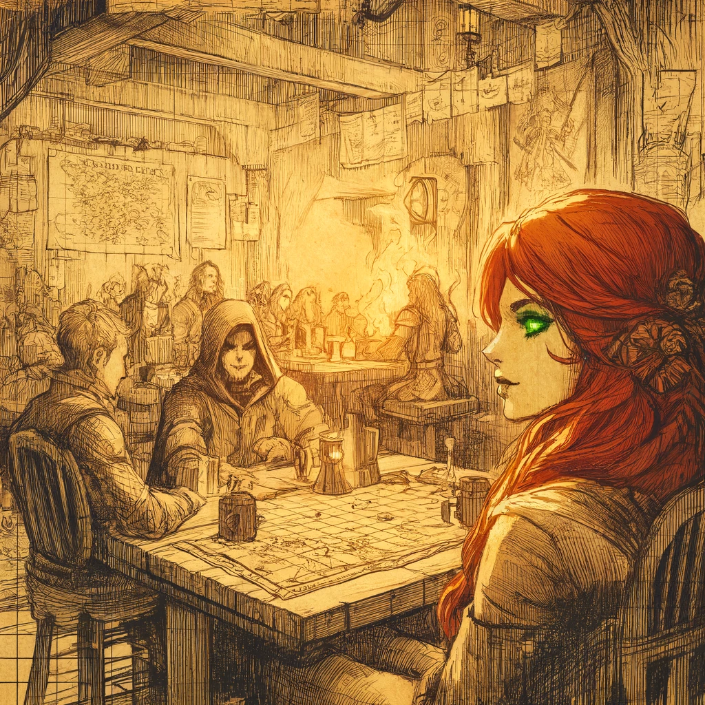
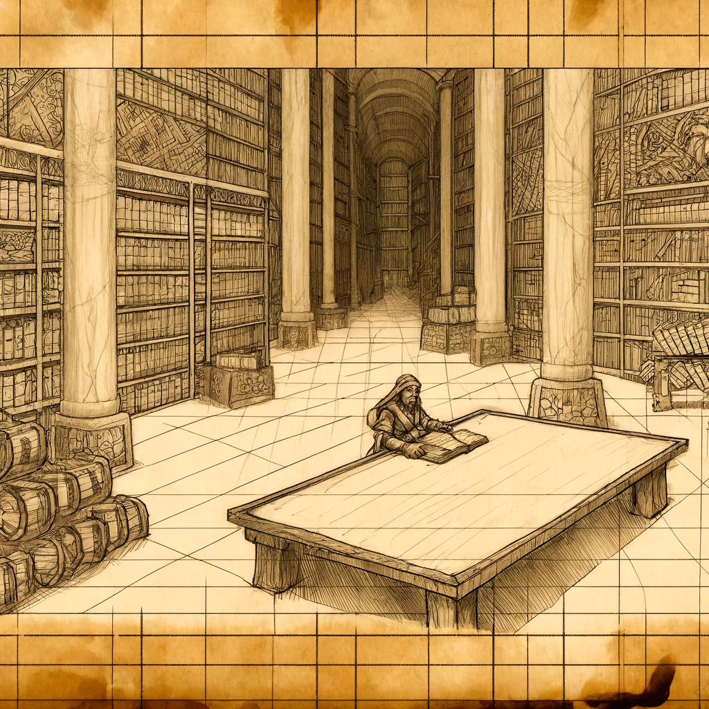
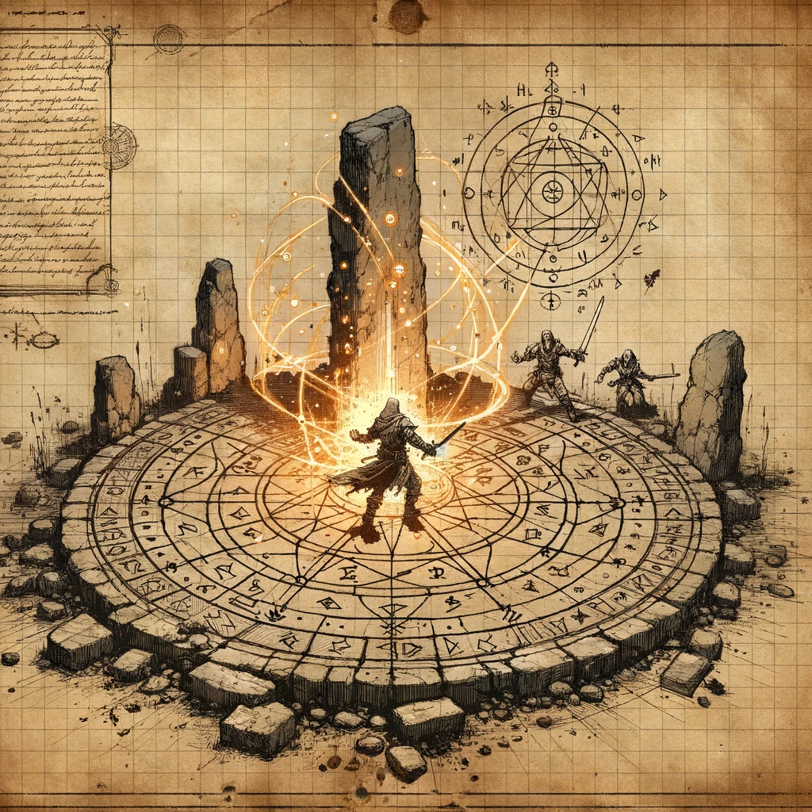
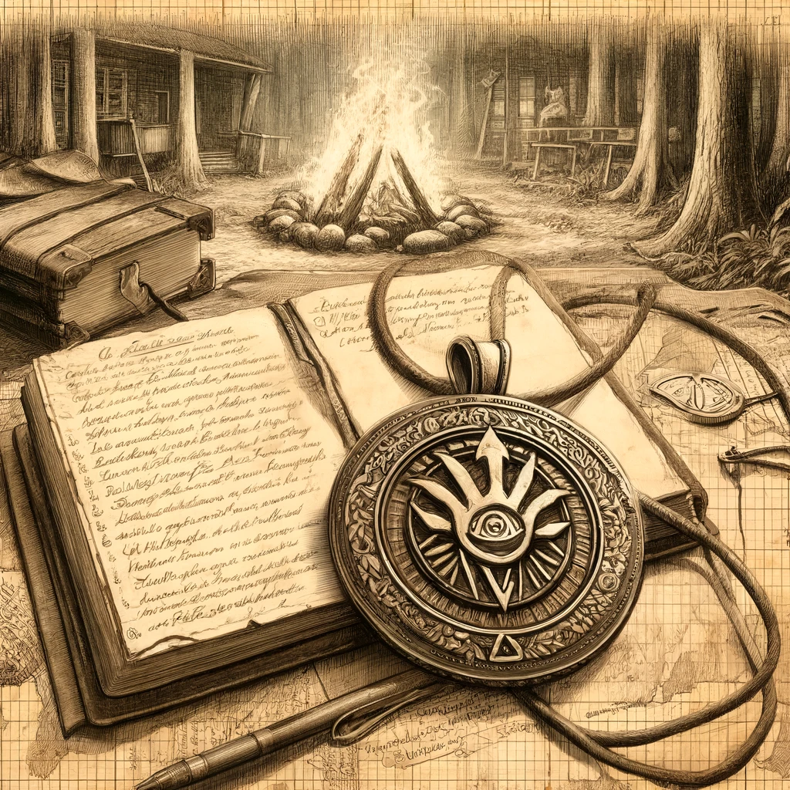

# The Beginning of the Quest

## Overview
Cindor and Eleria embark on a perilous journey to uncover the secrets of the Lost Forge of the Spellsmith, encountering cultists and ancient lore. This session details their initial meetings, research, and early encounters.

## Journey Log

### Meeting Eleria Whispersong
Today began in the cozy Embered Hearth Tavern in Emberhold. As I nursed my drink, a striking woman with fiery red hair and emerald-green eyes approached me. This was Eleria Whispersong, a historian with a passion for ancient lore. She shared tales of the Lost Forge of the Spellsmith and the Elemental Blade of Prometheus, a blade tied to my ancestors. Eleria's knowledge and enthusiasm were infectious, and it wasn't long before we decided to join forces. Her insight into the ancient mysteries aligned perfectly with my quest, and I felt a renewed sense of purpose.

- **Location:** Emberhold, Embered Hearth Tavern
- **NPCs:** Eleria Whispersong

### Research at the Grand Library of Ashenwall
Our next stop was the Grand Library of Ashenwall, a vast repository of knowledge. The air was cool and still, filled with the faint scent of old parchment. With the help of Archivist Maren and the shadowy Rothgar the Rogue Scholar, we uncovered the blade's history. It was forged in the fires of creation, wielded by a champion who defied the gods, and lost during the Calamity. The blade is believed to be hidden in the Spellsmith's forge in Emberfall. Each discovery felt like a piece of my heritage being restored, and I could almost feel the weight of the blade in my hand as we pieced together its story.

- **Location:** Emberhold, Grand Library of Ashenwall
- **NPCs:** Archivist Maren, Rothgar the Rogue Scholar

### Assistance from Captain Zara Stormshield
Seeking further aid, we visited the City Guard Headquarters and met Captain Zara Stormshield. She provided us with maps, supplies, and critical information about the Hand of Ash's movements, cautioning us to maintain a low profile to avoid attracting the cult's attention. Captain Stormshield's no-nonsense demeanor and strategic mind were reassuring. Her assistance meant we were better prepared for the dangers ahead, and her belief in our mission bolstered our resolve.

- **Location:** Emberhold, City Guard Headquarters
- **NPCs:** Captain Zara Stormshield

### Journey through the Whispering Woods
We set out at first light towards the Whispering Woods, navigating through dense forests and treacherous terrain. The forest was alive with the sounds of nature, but there was an eerie silence beneath the canopy. We discovered a hidden path near the Old Watchtower and investigated an abandoned campsite. There, we found a pendant bearing the symbol of the Hand of Ash and a journal with notes about a ritual and a gathering at the stone circle. The campsite was a stark reminder of the cult's pervasive influence, and the artifacts we found were clues that would guide our next steps.

- **Location:** Whispering Woods, Old Watchtower
- **Key Findings:** Pendant with Hand of Ash symbol, Journal with ritual notes

### Investigating the Stone Circle
Following the hidden path, we reached an ancient stone circle marked by glowing runes and remnants of a ritual setup. Tracks leading away from the circle indicated recent cult activity, adding another layer of urgency to our quest. The air was charged with lingering magic, and the runes seemed to whisper secrets of forgotten power. This discovery was both thrilling and ominous, a testament to the power and danger of our quest.

- **Location:** Whispering Woods, Stone Circle

## Notable Events
- **Meeting Eleria Whispersong**
- **Researching at the Grand Library of Ashenwall**
- **Securing assistance from Captain Zara Stormshield**
- **Discovering the abandoned campsite**
- **Investigating the stone circle**

## Learnings and Reflections
Reflecting on today's events, I realize the importance of ancient lore and teamwork. The journey so far has revealed the potential of the Elemental Blade of Prometheus and the dangers posed by the Hand of Ash. Our combined knowledge and skills have proven invaluable. The deeper we delve, the more I understand the significance of our mission and the weight of my ancestral legacy.

## Next Steps
With the new information and resources we've gathered, our next steps will be to:
- Investigate the ritual site at the stone circle to gather more information about the cult's activities and plans.
- Track the cultists by following the tracks leading away from the stone circle.
- Report our findings back to Emberhold and plan our next move.

## Experience Gained
Total experience points earned: 450

## Images
Include the following images to visually represent the day's adventures:
- 
- 
- 
- 
