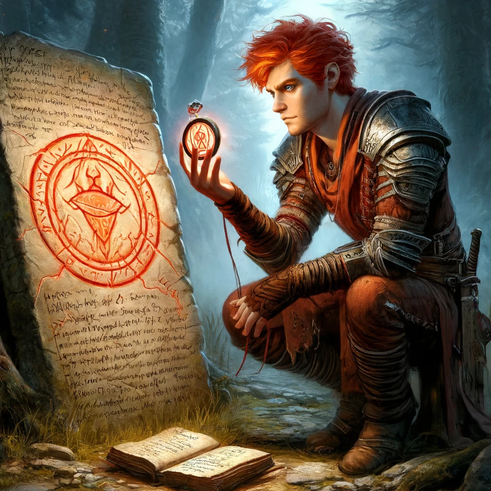
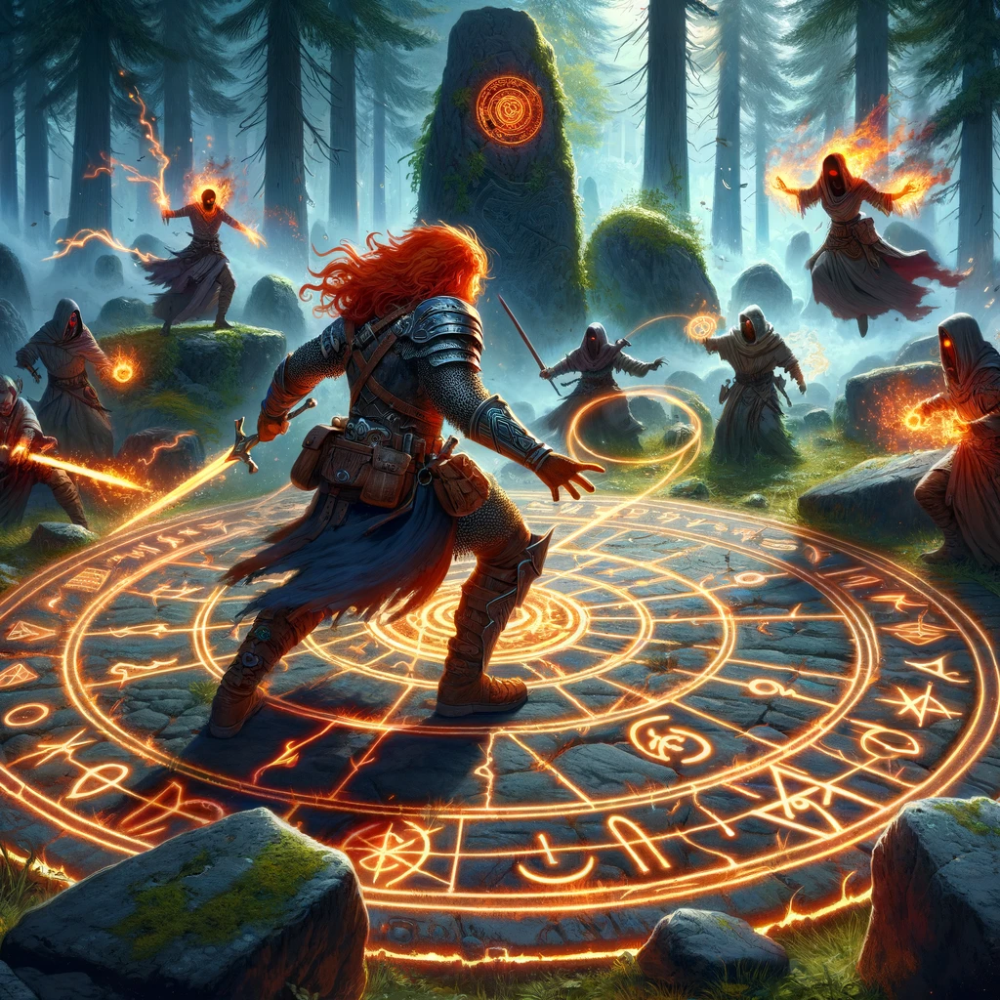
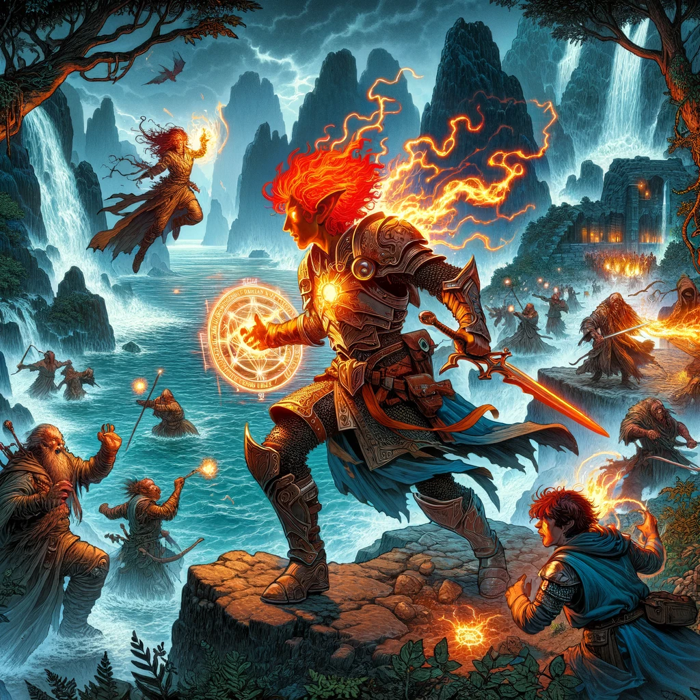

# The Search for the Elemental Blade

## Overview
Cindor and Eleria embark on a journey to uncover the secrets of the Lost Forge of the Spellsmith, encountering cultists and ancient lore.

## Journey Log
Today was a day filled with both peril and discovery. As we ventured through Emberhold and the Whispering Woods, we encountered valuable allies and dangerous cultists. Our journey started at the Embered Hearth Tavern and took us to the Grand Library of Ashenwall, the City Guard Headquarters, and deep into the forest.

### Meeting Eleria Whispersong at the Embered Hearth Tavern
At the Embered Hearth Tavern, I met Eleria Whispersong, a historian with a passion for ancient lore. She shared her knowledge about the Lost Forge of the Spellsmith and the Elemental Blade of Prometheus. This blade, tied to my ancestors, was lost during the Calamity and is believed to be hidden in Emberfall.

### Uncovering Secrets at the Grand Library of Ashenwall
Eleria and I headed to the Grand Library of Ashenwall to uncover more about the Elemental Blade. The archivist, Maren, directed us to Rothgar the Rogue Scholar, who revealed the blade's history and its connection to my lineage. The blade was forged in the fires of creation and wielded by a champion who defied the gods.

### Gathering Support from Captain Zara Stormshield
Next, we sought help from Captain Zara Stormshield at the City Guard Headquarters. She provided us with detailed maps, crucial information about the Hand of Ash's movements, and essential supplies. Captain Stormshield's support was invaluable as we prepared to venture into the Whispering Woods.

### Discovering Clues in the Whispering Woods
The Whispering Woods were dense and foreboding. We navigated through key landmarks such as the Old Watchtower and the Whispering Stream, staying on course and avoiding potential dangers. Near the Old Watchtower, we discovered an abandoned campsite with multiple sets of footprints, a pendant bearing the symbol of the Hand of Ash, and a journal with notes about a ritual at the stone circle.

### Investigating the Ritual at the Stone Circle
We followed the hidden path to an ancient stone circle marked by glowing runes. The site showed remnants of a ritual performed by the Hand of Ash. Tracks leading away from the circle suggested that the cultists had recently moved on. This discovery added another layer of mystery and danger to our journey.

### Battling Cultists at the Hidden Cove
We continued our journey and stumbled upon a hidden cove along the coast. The cove was guarded by more cultists performing another ritual. Eleria and I observed from a distance and then ambushed them. After a fierce battle, we managed to defeat the cultists and secure the area.

## Learnings and Reflections
Reflecting on the day's events, I realize the importance of ancient lore and teamwork. The challenges we faced have taught me the potential of the Elemental Blade of Prometheus. Our combined efforts are essential for overcoming the dangers that lie ahead.

## Next Steps
With the new information and resources we've gathered, our next steps will be to:
1. Investigate the first ritual site marked on the map.
2. Track the cultists.
3. Report our findings back to Emberhold.

## Experience Gained
Total experience points earned: 550

## Images
Include the following images to visually represent the day's adventures:
- 
- 
- 
- 
- 
