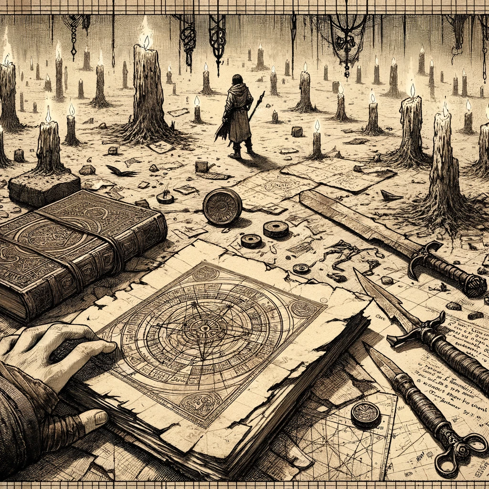
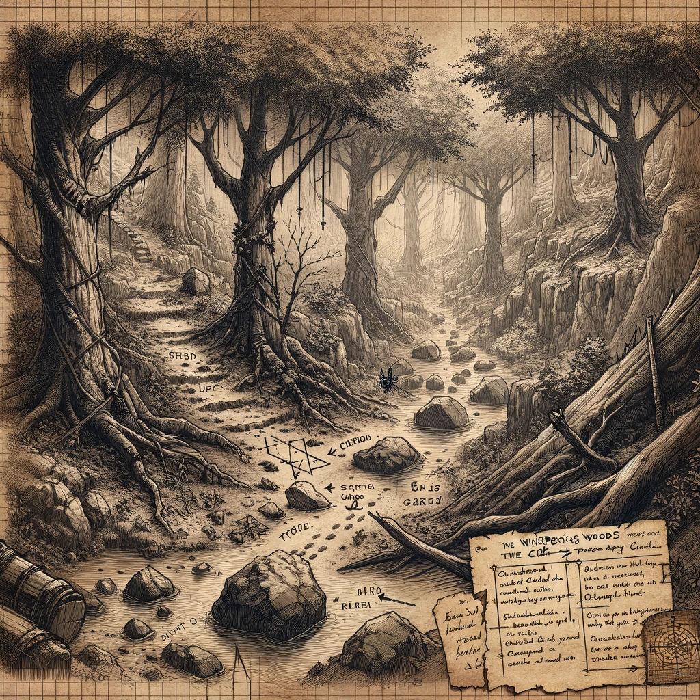
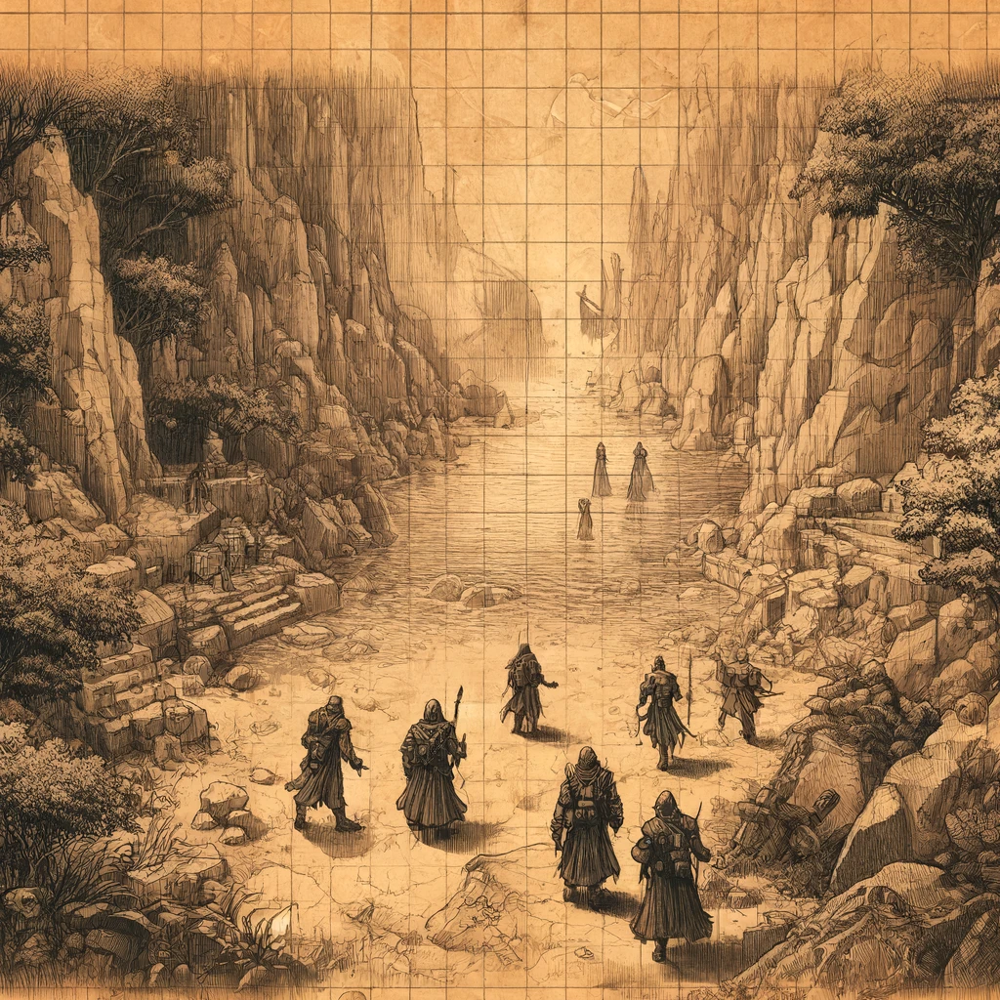

# Investigating the Hand of Ash

## Overview
Continuing their quest, Cindor and Eleria delve deeper into the Whispering Woods, facing new challenges and uncovering critical information about the Hand of Ash. This session details their further investigations, battles, and discoveries.

## Journey Log

### Discovering More Clues
We returned to the stone circle, uncovering more clues about the Hand of Ash's next move. The lingering magic and the cult's meticulous preparations suggested something significant was about to happen. As we examined the site, I couldn't shake the feeling that we were being watched, the forest itself seemed to hold its breath in anticipation.

- **Location:** Whispering Woods, Stone Circle

### Tracking the Cultists
We tracked the cultists' movements through the forest, avoiding their traps and ambushes. The path led us deeper into the Whispering Woods, where the atmosphere grew more ominous with every step. The forest was a labyrinth of shadows and whispered secrets, each turn revealing new challenges.

- **Location:** Whispering Woods

### Encounter at the Secondary Ritual Site
Our pursuit led us to a secondary ritual site, guarded by more cultists. A fierce battle ensued, testing our combat skills and resolve. We managed to defeat the cultists and secure additional ritual notes and a map leading to another key location. The battle was intense, every swing of my sword and every spell cast felt like a fight for survival. Eleria's quick thinking and magical prowess were invaluable, turning the tide in our favor.

- **Location:** Secondary Ritual Site
- **NPCs:** Hand of Ash Cultists

### Securing Important Artifacts
Among the items recovered were detailed ritual notes and a map indicating another critical location for the cult's activities. These findings could prove crucial in our ongoing efforts to thwart the Hand of Ash. The notes hinted at darker rituals and greater dangers, and the map promised more perilous journeys ahead.

- **Location:** Secondary Ritual Site
- **Key Findings:** Ritual notes, Map to key location

## Notable Events
- **Discovering more clues at the stone circle**
- **Tracking the cultists' movements**
- **Battle at the secondary ritual site**
- **Securing additional ritual notes and map**

## Learnings and Reflections
Reflecting on today's events, I realize the depth of the cult's dedication and the importance of our mission. Each encounter sharpens our skills and deepens our understanding of the threats we face. The cult's determination is daunting, but our resolve is stronger.

## Next Steps
With the new information and resources we've gathered, our next steps will be to:
- Investigate the first ritual site marked on the map.
- Track the cultists to their next gathering place.
- Report our findings back to Emberhold and plan our next move.

## Experience Gained
Total experience points earned: 325

## Images
Include the following images to visually represent the day's adventures:
- 
- 
- 
