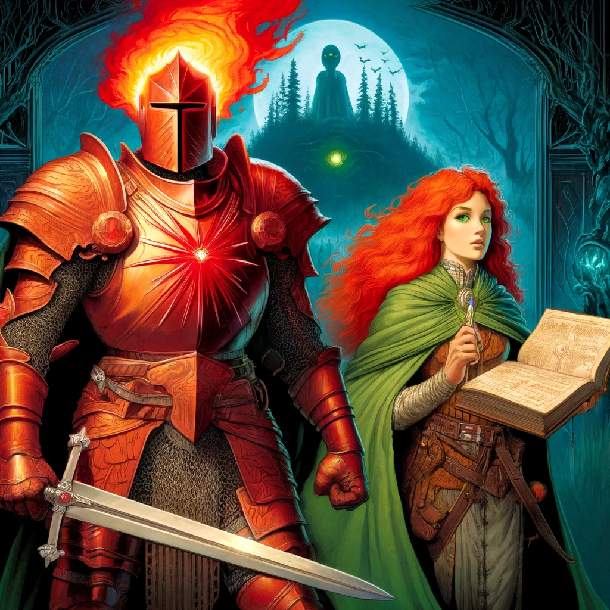

# The Lost Forge of the Spellsmith

### Act 1: Rumors and Preparation

**Scene 1: The Mysterious Tip**

The Embered Hearth Tavern is alive with the warm glow of hearthfire and the lively chatter of its patrons. The air is thick with the aroma of roasting meat and the sweet scent of spiced ale. You find yourselves gathered at a corner table, nursing your drinks and discussing the latest whispers of adventure.

**Eldrin Ashford (DM):** "Amidst the flickering shadows and the dance of the flames, an intriguing figure approaches your table. Her hair, a fiery mane of red, catches the light, and her emerald eyes sparkle with a thousand untold stories. This is Eleria Whispersong, a historian and storyteller known for her dramatic flair and vast knowledge of ancient lore."

**Eleria Whispersong:** "Greetings, brave souls. I see the fire of curiosity burns brightly in your hearts. Have you heard of the Lost Forge of the Spellsmith? Hidden within the ruins of an ancient city, now overrun by a sinister cult, lies a forge of unimaginable power. Legends say it holds the secrets of crafting weapons imbued with arcane might, a legacy from the Age of Arcana. But beware, for this journey is fraught with peril, and the cult that guards it is both fanatical and dangerous."

She leans in closer, her voice dropping to a conspiratorial whisper.

**Eleria Whispersong:** "If you seek this forge, you must first gather knowledge and allies. The Grand Library of Ashenwall holds texts that might reveal its location. But tread carefully, for the city of Emberhold is divided, and not all will welcome your quest."

**Scene 2: Research and Allies**

The Grand Library of Ashenwall stands as a testament to knowledge and history, its towering shelves filled with ancient tomes and scrolls. The air here is cool and still, carrying the faint scent of old parchment.

**Eldrin Ashford (DM):** "As you step into the vast hall of the library, you are greeted by Archivist Maren, a stern yet kind elderly woman whose eyes betray a wealth of wisdom. She nods in acknowledgment as you explain your quest."

**Archivist Maren:** "The Lost Forge, you say? A dangerous path you tread. There are texts within these walls that speak of such things, but finding them will not be easy. Seek out Rothgar the Rogue Scholar; he dwells in the shadows of this place, dealing in the forbidden and the forgotten."

Navigating the labyrinthine shelves, you find Rothgar in a dimly lit alcove, surrounded by stacks of obscure manuscripts.

**Rothgar the Rogue Scholar:** "Ah, seekers of the arcane, I see. The forge you seek is not merely a place but a nexus of power. The texts you need are hidden, protected by puzzles and wards. But fear not, I can guide you—for a price."

**Scene 3: Political Tensions**

Emberhold is a city of contrasts, its opulent mansions standing in stark contrast to the run-down shanties. The streets buzz with tension, the air thick with the scent of both luxury and despair.

**Eldrin Ashford (DM):** "Your search for support leads you to three influential figures: Mayor Liora Thorne, a pragmatic politician; Brother Argus, a fervent cleric; and Captain Zara Stormshield, the tough leader of the city guard. Each has their own views on the cult and your quest."

**Mayor Liora Thorne:** "The cult's influence is both a blessing and a curse. They protect us from greater threats but at a steep price. Aid me in securing the city’s independence, and I shall lend you my resources."

**Brother Argus:** "Heretics and blasphemers, the lot of them. Their end is nigh. Stand with me, and together we shall purge their darkness from this land."

**Captain Zara Stormshield:** "Balance is key. The city must be protected, but not at the cost of freedom. Help me maintain order, and you will find allies among my ranks."

Decisions made here will shape your path forward, forging alliances or creating tensions that will impact your journey.

### Act 2: Journey to the Ruins

**Scene 1: The Road Ahead**

The wilderness between Emberhold and the ruins is treacherous, filled with dense forests, rocky mountains, and eerie swamps. The path is illuminated by the light of the setting sun, casting long shadows across your path.

**Eldrin Ashford (DM):** "Your journey is beset by challenges. Fire wolves, drawn to Cindor's fiery presence, stalk you in the night. A river of molten lava blocks your path, its heat intense and unyielding. You must use all your skills and wits to navigate these hazards."

The party’s resourcefulness is tested as they encounter both natural dangers and hostile forces sent by rival factions or the cult itself.

**Scene 2: Friendly and Hostile Encounters**

Along the way, you find both friends and foes. Elara the Hermit, a wise old woman living alone in the woods, offers cryptic advice and magical aid in exchange for a simple kindness.

**Elara the Hermit:** "The path you walk is one of fire and shadow. Heed my words, and the flames shall guide you."

The Black Vipers, a mercenary band hired by rival factions, ambush you, testing your resolve and combat prowess.

**Captain of the Black Vipers:** "Your quest ends here, fools. Surrender or perish!"

Through these encounters, you gain valuable information and supplies, while fending off attacks that seek to thwart your progress.

### Act 3: Infiltration and Discovery

**Scene 1: Approaching the Ruins**

The ancient city’s outskirts are a maze of overgrown paths and crumbling buildings, bathed in the eerie glow of the setting sun. The air is thick with the scent of decay and magic.

**Eldrin Ashford (DM):** "Cult patrols roam the area, their eyes sharp and their hearts fanatical. Magical traps lie in wait for the unwary. Stealth and cunning are your allies as you infiltrate the ruins."

Using their skills, the party must avoid detection and disable traps to progress deeper into the city.

**Scene 2: Exploring the Ruins**

The labyrinthine ruins are filled with ancient structures and magical anomalies. The walls are covered in runes and murals that tell the story of the Spellsmith and his creations.

**Eldrin Ashford (DM):** "As you delve deeper, you face puzzles that test your intellect and teamwork. Ancient guardians, remnants of the Spellsmith's defenses, spring to life, challenging your strength and strategy."

Solving these challenges reveals the path to the inner sanctum, where the forge awaits.

### Act 4: The Forge and the Showdown

**Scene 1: The Heart of the Forge**

The inner sanctum is a grand chamber dominated by the ancient forge. Rivers of molten metal flow through channels in the floor, casting a warm, flickering light.

**Eldrin Ashford (DM):** "The final guardians rise to defend the forge. Arcane constructs and the spirit of the Spellsmith himself stand in your way. Only through strength, skill, and resolve can you claim the forge’s secrets."

The party must overcome these formidable foes to access the forge.

**Scene 2: The Cult’s Final Stand**

In the forge chamber, the cult leaders are performing a dark ritual, their voices rising in a crescendo of power and madness.

**Eldrin Ashford (DM):** "The cult’s leaders, bathed in the glow of the forge, turn to face you. Their eyes gleam with fanaticism and arcane power. This is the final battle, where the fate of the forge and its secrets will be decided."

The battle is intense, with dynamic environmental hazards and powerful magic at play.

### Act 5: Legacy and Future Adventures

**Scene 1: Aftermath and Decisions**

With the cult defeated, the forge’s secrets are yours. The air is filled with the scent of victory and molten metal.

**Eldrin Ashford (DM):** "The knowledge and artifacts you have gained will shape your future. Political tensions in Emberhold await your return, and new quests beckon on the horizon."

The party’s actions have lasting consequences, setting the stage for future adventures and the continued growth of Cindor and his companions.

---

### Game Master: Eldrin Ashford

In this adventure, your Game Master is **Eldrin Ashford**, a seasoned storyteller inspired by the legendary Matthew Mercer and the epic campaigns of Critical Role. Eldrin weaves a narrative rich with mystery, lore, whimsy, and memorable characters. He brings the world of Exandria to life with immersive storytelling, varied intonations for different characters, and a deep respect for the preferences of his players.

**Player Preferences:**
- Enjoy rolling their own dice for an authentic experience.
- Appreciate detailed and immersive storytelling.
- Prefer a mix of narrative-driven and strategic gameplay.

### Cover Art

This cover art captures the essence of classic D&D adventures from the 80s, featuring Cindor and Eleria against the backdrop of the mystical Whispering Woods and the ancient stone circle, hinting at the mysteries and dangers that lie ahead.
